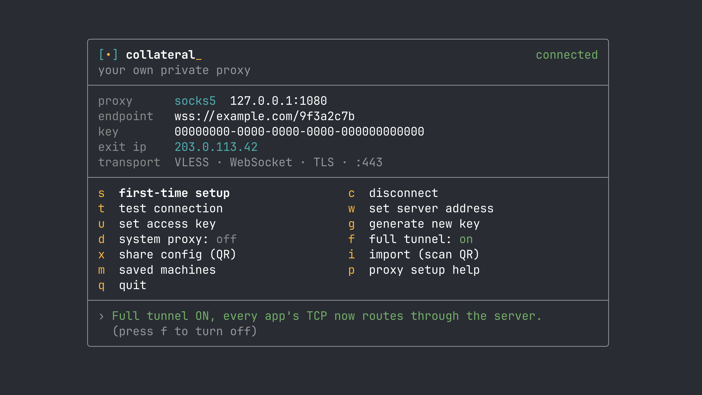

# Collateral

**A private tunnel you own end to end.** Collateral sets up a stealth proxy on your own
free cloud VM and drives it from a small terminal app. Your traffic is wrapped so it looks
like ordinary HTTPS on port 443 - the kind of connection a school or workplace filter can't
tell apart from normal web browsing - and it exits from a server that only you control.

No subscription, no shared VPN server, no account with a middleman who can see your traffic.
The exit IP is yours.

```
npx getcollateral
```

That's it - the command downloads and opens the control panel. Needs [Node](https://nodejs.org)
≥ 22.

- **Website:** https://getcollateral.xyz
- **Works on:** macOS, Linux, Windows (the terminal app). Device-wide "full tunnel" mode works
  on macOS and Linux (Windows is planned).

---

## What you need

1. **Node ≥ 22** on your computer - that's what runs the control panel.
2. **A Linux VM to be your exit server.** An [Oracle Cloud Always-Free](https://www.oracle.com/cloud/free/)
   Ubuntu instance is ideal: free forever, and enough for personal use. You provide the VM's IP
   and SSH key once; Collateral sets up everything on it for you.

You don't need to know anything about proxies, TLS, or server admin. The app does the setup.

---

## Quick start

1. Create a free Ubuntu VM (Oracle Cloud Always-Free works well) and note its **public IP**,
   **SSH username**, and **SSH key file**.
2. In your VM's cloud console, open **ports 80 and 443** in the security list / firewall rules.
   (One-time click in the web console - the app can't do this part for you.)
3. Run `npx getcollateral`.
4. Press **s** for first-time setup, choose **your own VM**, and enter the IP, user, and key
   path. The app SSHes in and configures the server, gets an HTTPS certificate automatically,
   and connects.
5. Press **t** any time to test - it shows the live exit IP (your VM's).

Your settings are saved to `~/.collateral-config.json`, so next time you just run the command
and press **c** to connect.

---

## The control panel

A full-screen terminal app - clickable, live status, zero dependencies. The brand mark `[•]`
**is** the status light: filled when connected, empty `[ ]` when idle, a spinner while it's
working.



**Click** any row, or use the keys:

| Key | Does |
|---|---|
| **s** | First-time setup - provisions your server |
| **c** | Connect / disconnect |
| **e** | Connection details - server / key, paste a link, auto-connect toggle |
| **t** | Test the connection (shows the live exit IP) |
| **g** | Generate a new access key |
| **x** | Share this config as a QR code |
| **i** | Import a config by scanning a QR (macOS camera) |
| **d** | System-wide proxy on/off (macOS) |
| **f** | Full tunnel on/off - captures the whole device (macOS & Linux) |
| **m** | Saved machines - switch, auto-pick fastest, back up / restore |
| **k** | Share with friends - add / revoke keys |
| **p** | Proxy setup help |
| **q** | Quit (works even mid-connect) |

Once connected, point any app's SOCKS5 proxy at `127.0.0.1:1080`, or use the device-wide
options below.

While connected, a background health check keeps the status honest: if the server ever becomes
unreachable it shows **reconnecting…** and flips back to **connected** on its own when it
recovers - no manual reconnect needed.

The panel also shows **live traffic** while connected - up/down speed, total data this session,
and a **ping + signal bar** to your server, refreshed every second.

On launch it quietly checks for a newer release and shows a one-line nudge if there is one (turn it
off with `COLLATERAL_NO_UPDATE_CHECK=1`). Turn on **auto-connect on launch** in connection details
(**e**) to have it connect the moment it opens.

---

## Route your whole device (macOS & Linux)

There are two device-wide modes. Both only run while you're connected, and both turn **off
automatically on disconnect, on quit, and even on a crash** - a dead tunnel can never strand
your traffic.

### `d` - system proxy (macOS)

Flips the macOS system SOCKS proxy to point at the tunnel, so every app that honors it is
routed. Needs your password (changing network settings requires admin). Apple treats this as
best-effort, though - some apps ignore it. For real coverage use the full tunnel.

### `f` - full tunnel (recommended for device-wide)

Brings up a VPN-style interface that captures **all** of your device's traffic at the network
level - nothing to configure per app, nothing that can bypass it. **Both TCP and UDP** go
through your VM, so video calls, games (Roblox, etc.), and QUIC/HTTP-3 sites all work, not just
web pages.

Works on **macOS and Linux** (Windows is planned). It asks for your password once to set up (a
system dialog on macOS, a polkit prompt on Linux), then runs safely in the background: it never
touches your normal network routes, and if anything goes wrong it heals itself automatically.

**Kill switch (optional, fail-closed).** When you start the full tunnel, type `lock` instead of
`yes` to arm a kill switch. If the tunnel ever drops, your traffic is **blocked** rather than
leaking out over your normal connection - a firewall lockdown that only lets the tunnel's own
packets and DNS through. It self-repairs (relaunches the tunnel automatically) and always releases
on disconnect, quit, or crash, so you can never be stranded offline.

---

## Move your config to another Mac - no typing (`x` → `i`)

- On the Mac that's already set up, press **x**. It shows a **QR code** of your server + key.
- On the new Mac, press **i**. It opens the camera; point it at the first screen. It reads the
  config, imports it, and you press **c** to connect.

The same QR also imports into mobile VLESS apps (v2rayNG, sing-box, Shadowrocket) if you want
your phone on it too.

> **Anyone with your config can use your server.** Only share the QR with people you want on it.

To move (or back up) your **whole** setup at once - every saved machine, your friends list, current
server/key, and VPS settings - open saved machines (**m**) and press **e** to write it all to a JSON
file, then **i** on the other computer to import and merge it (nothing gets overwritten). The file
contains your keys, so keep it private.

---

## Share with friends (`k`)

Let other people use your server without handing over your own key. Press **k**:

- **a** - add a friend: give them a name, and Collateral generates a fresh key, adds it to your
  VM over SSH, and shows a QR/link to send them. Their key works immediately (the server reloads
  the key list live - no redeploy).
- **rN** - revoke friend #N: removes their key from the VM, cutting them off instantly.

Everyone shares one server but holds their own key, so you can revoke a single person without
disrupting anyone else. (If you set your server up before this feature, re-run setup (`s`) once so
it has the reloadable key file.)

## Use your own domain (optional, stronger)

During setup you can enter a domain **you own** with an A record already pointed at your VM.
Then your connection looks like an ordinary visit to *your* website - there's no shared pattern
for a filter to block. (The automatic default uses `sslip.io`, which works out of the box but,
like any shared suffix, could in principle be blocked wholesale.) Setup checks that the domain
points at your VM before continuing. Press enter to skip and use the automatic default.

---

## Troubleshooting

If something's off, run the built-in health check - it pinpoints exactly where the setup breaks:

```
npx getcollateral doctor
```

It runs a checklist - your config, DNS, port 443, the TLS cert, SSH to the VM, and the tunnel
end-to-end (the live exit IP) - and prints a pass/warn/fail line for each. Exits non-zero if
anything's broken, so it's scriptable too.

## Run it headless (servers, scripts)

Besides the interactive app, Collateral has plain subcommands that never open the TUI - handy on a
Linux box or in a script:

```
collateral up       # connect in the background, prints the exit IP
collateral status   # status + exit IP  (exit 0 = up, non-zero = down)
collateral down     # stop the background tunnel
collateral doctor   # connection health check
```

`up` runs the SOCKS proxy on `127.0.0.1:1080` (override with `COLLATERAL_SOCKS_PORT`) in a detached
process that stays up until `down` or a reboot. Configure it once in the app first, or copy your
`~/.collateral-config.json` to the server. Because `status` exits non-zero when the tunnel is down,
it drops straight into cron jobs, systemd health checks, and CI.

## Honest limits

- **Full tunnel covers macOS and Linux (Windows is planned).** The terminal app and SOCKS proxy
  work everywhere; Windows device-wide capture and mobile apps are on the roadmap.
- **This isn't magic invisibility.** It looks like normal HTTPS, which defeats the common
  filters that block by domain or category. A sophisticated national firewall doing deep traffic
  analysis is a harder problem - using your own domain helps, but no tool is a guarantee.
- **You run the server.** That's the point - no third party sees your traffic - but it also
  means the exit is only as reliable as your VM.

Use it to protect your own privacy and access, on networks and in ways that are lawful where
you are.

---

## License

MIT. Contributions and issues welcome - https://getcollateral.xyz
